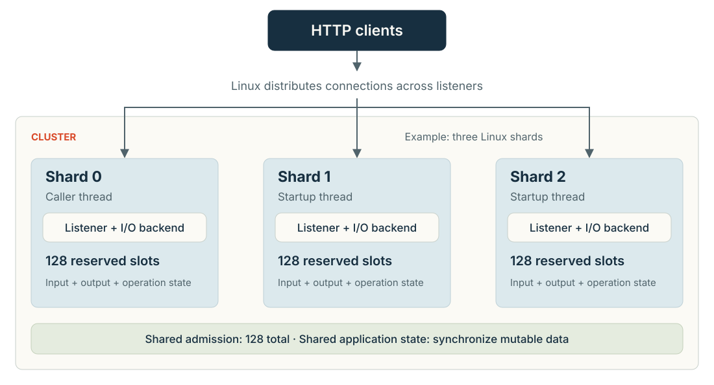
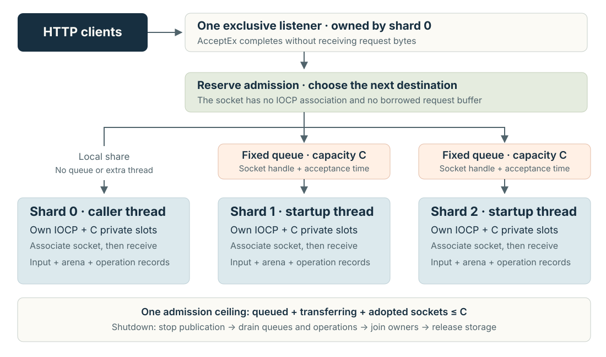
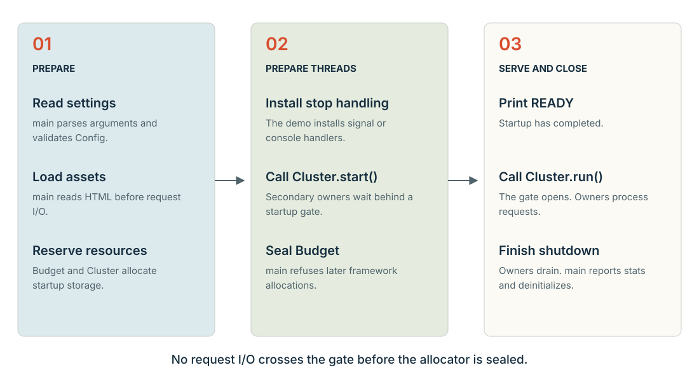
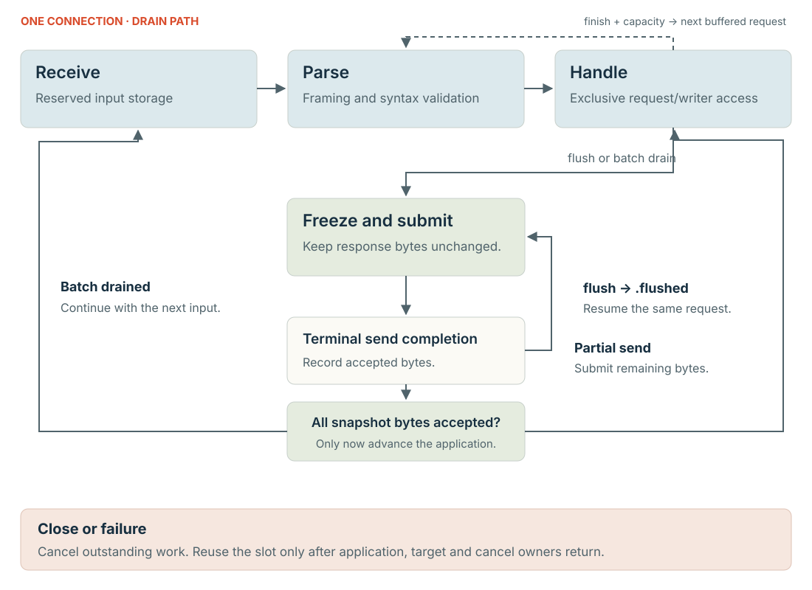
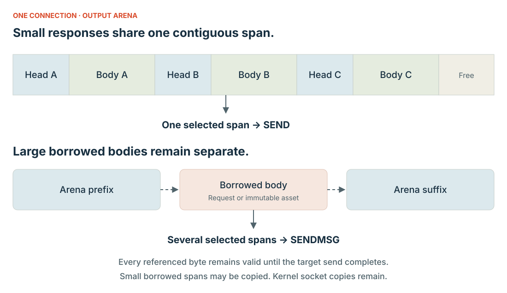

# bounded/http architecture

The server provides bounded HTTP/1.1 processing with explicit ownership of memory and network operations.
The current implementation targets exact Zig 0.16.0.
Linux uses `io_uring`.
macOS uses nonblocking sockets and `kqueue`.
Windows uses overlapped sockets and an I/O completion port (IOCP), which delivers operation results to the owner.

The server remains experimental.
The listener accepts IPv4 loopback connections only.
The implementation has no Transport Layer Security (TLS), protocol upgrade, or tunnel support.
See [using the server](USING.md) for embedding instructions.

## Terms

| Term | Meaning |
| --- | --- |
| Owner | A thread with exclusive authority to advance one server instance's network state. |
| Shard | One server instance, with an owner, transport adapter, and private connection storage. |
| Handoff | Transfer of exclusive socket ownership from the accepting shard to another shard. |
| Cluster | The coordinator for one or more shards. |
| Slot | A startup reservation containing one connection's input, output, parser state, and operation bookkeeping. |
| Arena | One contiguous output buffer assigned to a slot. |
| Cell | A fixed record with one specific purpose. |
| Snapshot | Committed response bytes that remain frozen until the owner finishes transmitting them. |
| Response cell | A record describing one snapshot, including an optional reference to existing body bytes. |
| Operation cell | A transport record for one pending network or cancellation operation. |
| Batch | An ordered group of response cells awaiting transmission. |
| Completion | An adapter report that an operation has ended, with its identity and result. |
| Borrow | Permission to reference existing storage while another component retains that storage. |
| Turn | One iteration of the owner's event loop. |

Response cells and operation cells serve different purposes.
The server can retain many response cells behind one send operation.

## Topology and execution

`Cluster` creates each shard before serving requests.
Shard zero runs on the thread that calls `Cluster.run()`.
The cluster creates secondary owner threads during `Cluster.start()`.
The framework creates no threads during request processing.

A CPU denotes a logical processor here.
Linux defaults to one shard per allowed CPU, with a maximum of 16.
Explicit Linux and Windows configurations can select up to 64 shards.
Windows defaults to one shard; select additional owners with `--shards N`.
macOS currently requires one shard.
These choices belong to this implementation, rather than the `std.Io` interface contract.

Each Linux shard has a separate listener using `SO_REUSEPORT`.
The kernel distributes accepted connections among those listeners.
The cluster shares a connection admission counter across shards.
Each shard reserves the full configured slot count because distribution can be uneven.

### Windows socket handoff

Windows uses one exclusive listener, owned by shard zero.
Shard zero also processes its own share of connections.
Each secondary shard has its own IOCP, operation records, and connection storage.
The cluster creates no additional acceptor thread.

`AcceptEx` accepts without reading request bytes.
Shard zero collects the terminal accept completion before transferring the socket.
The accepting adapter updates the socket's listener context while the listener remains alive.
The socket has no IOCP association at this point.

Shard zero reserves one shared admission charge, then chooses destinations in round-robin order.
A charge remains held during transfer, queue residence, and connection processing.
Each secondary queue has one producer and one consumer.
Queue publication transfers only the socket handle and acceptance timestamp.
No request bytes move between shard buffers.

The destination associates the socket with its own IOCP before receiving bytes.
That association lasts until the socket closes.
An established connection stays with its destination; the server does not migrate live requests.

Each queue holds at most the configured connection count.
The shared admission ceiling applies across all queues and adopted connections.
Owners process at most that many queued entries per turn.
Remaining entries force another nonblocking poll.
Notifications wake owners; a ten-millisecond poll timeout provides a fallback.

The destination checks the original acceptance deadline before adoption.
Queue residence never resets that deadline.
Import failures and expired entries close their sockets and release admission.

### Inline callbacks

Inline execution is the default.
The owner invokes application callbacks directly.
This mode creates zero application workers.
Each callback must finish promptly without blocking.
The owner cannot advance other connections while that callback runs.

A queue serves ready slots in first-in, first-out order.
Each slot can occupy that queue once.
The owner limits callbacks per turn with `callbacks_per_turn`.
The owner also limits each connection's work with `response_batch_limit`.
These limits bound scheduling work when callbacks obey their contract.
They cannot preempt application code.

### Worker callbacks

Worker execution requires one shard.
The framework creates a fixed number of application workers at startup.
The owner assigns each slot to `slot_index % workers`.
The implementation does not steal work between workers.

The owner publishes exclusive access to request state and output storage before a worker invokes the callback.
The worker publishes the callback result before the owner processes its output.
This handoff does not require copying the request payload.
The owner copies its response header cache into slot storage before worker dispatch.
Windows workers wait on events created at startup.
Worker results notify the I/O owner through a completion-port control packet.

A blocked callback delays other slots assigned to that worker.
Workers share memory and process fate with the owner.
Worker execution therefore provides scheduling separation without arbitrary application isolation.

### Shared application state

Every callback receives the same application pointer supplied to `Cluster.init()`.
Callbacks on different shards can execute concurrently.
Callbacks on different workers can also execute concurrently.
The application must keep shared data immutable or synchronize access.
The framework permits only one active callback per connection.

## Startup and shutdown

[The reference executable](../src/main.zig) uses the following sequence.
An embedding application must preserve the ownership boundaries in this sequence.

1. Zig supplies `std.process.Init` to `main`.
2. The executable parses arguments using the startup allocator.
3. `Cluster.validate()` checks configuration, topology, and total requested heap and stack bytes.
4. `Cluster.resolveShards()` determines the number of owners.
5. The executable reads the HTML asset through `init.io` before serving requests.
6. The executable prepares application state that remains valid throughout the cluster lifecycle.
7. The executable subtracts `Cluster.stackBytes()` from `memory_budget_bytes` to establish the framework heap limit.
8. The executable constructs `Budget` with that heap limit.
9. `Cluster.init()` allocates framework storage and initializes listeners and transport adapters.
10. The executable installs signal or Windows console handlers that set atomic stop flags.
11. `Cluster.start()` prepares workers and secondary owner threads behind a startup barrier.
12. The executable seals the framework allocator after startup succeeds.
13. The executable prints `READY` with the selected configuration and port.
14. `Cluster.run()` releases the barrier and executes shard zero on the caller's thread.

The demo uses `init.io` for startup file access.
Request networking uses the custom transport adapters.
It does not pass through a `std.Io.Threaded` or `std.Io.Evented` implementation.

Listeners exist before the barrier opens.
The kernel can queue connections during this interval.
Owners submit no request operations before `Cluster.run()` releases them.
No application callback runs before that release.

The startup failure path releases prepared secondary threads without admitting requests.
The cluster waits for exit acknowledgements before joining those threads.
It also stops already prepared server instances before freeing their storage.
Finite startup waits can terminate the process if acknowledgement never arrives.

After a successful run, the demo prints per-shard counters and combined `STATS`.
The demo serializes those statistics with its startup allocator after request processing ends.
Deferred cleanup destroys the cluster before freeing application assets.
The budget check then requires zero remaining framework heap bytes.
Windows console callbacks can run on separate operating-system threads.
The executable clears its published cluster pointer and reconciles outstanding handler references before destroying the cluster.

## Request processing

The owner assigns an admitted connection to a slot.
The transport receives bytes directly into that slot's input buffer.
The parser validates framing and waits for the complete bounded request.
The application receives its first callback with `event = .request`.

The parser validates every header's syntax.
It interprets fields needed for framing and connection control during parsing.
These fields include `Host`, `Content-Length`, `Transfer-Encoding`, `Connection`, and `Expect`.
Other header values remain available for lazy lookup.

The parser rejects ambiguous framing before application dispatch.
For example, it rejects duplicate `Content-Length` fields and combined `Content-Length` and `Transfer-Encoding` fields.
Chunked request bodies retain their original wire storage.
The body iterator returns payload spans while skipping chunk framing.

The callback begins a response and supplies body bytes through its writer.
The callback then returns one action:

| Action | Owner behavior |
| --- | --- |
| `.flush` | Transmit committed output, then resume the same request with `.flushed` when transmission succeeds. |
| `.finish` | Finish response framing and retain its output until transmission completes. |
| `.close` | Close the connection without promising another callback or an HTTP error response. |

The owner can combine finished responses from pipelined requests into one batch.
A flush requires the owner to drain earlier responses and the current snapshot before resuming the callback.
Partial sends advance a bounded cursor through the batch.
A completion releases operation storage only after that operation ends.

The owner preserves request input while response cells still reference it.
After the batch drains, the owner can reuse its arena and response cells.
The owner can then compact any remaining pipelined input.
That compaction copies bytes and increments `pipeline_copy_bytes`.

The [ownership contract](OWNERSHIP.md) describes cancellation races and connection state transitions in greater detail.

## Output layout and copies

`Writer.begin()` writes the response head into the slot's arena.
`reserve()` gives the application a writable slice within that arena.
`commit()` records how many initialized bytes the application produced.
`write()` copies existing bytes into the arena.

A one-shot response adapter can request complete scratch capacity through `callback_output_reserve` before callback dispatch.
The owner drains older output when that capacity cannot fit, then dispatches the preserved request once.
Checked draft methods expose unpublished storage without exposing writer lifecycle fields.
The `response_draft_copy_bytes` counter records staged body copies before publication.

`borrow()` accepts existing request storage or immutable server-lifetime assets.
The default implementation copies eligible borrowed spans of at most 256 bytes into the arena.
The `borrow_copies` counter records those copies.
Larger spans remain separate references in response cells.

Adjacent arena ranges become one transport span.
A batch containing separate borrowed spans uses a vector list.
The Linux adapter selects `SEND` for one span and `SENDMSG` for multiple spans.
The macOS adapter uses the corresponding socket operations.
The Windows adapter submits one or several spans through `WSASend`.
`send_chunk` limits bytes submitted by one send operation.

Ordinary socket operations still copy data across the kernel boundary.
This implementation does not use `SEND_ZC`, zero-copy receive, or `sendfile`.
Its borrow mechanism avoids selected application copies while preserving storage lifetimes.

## Resource boundaries

Let `C` mean configured connections and `S` mean resolved shards.
Let `B` mean the effective response batch limit.
Worker execution fixes `B` at one.
Inline execution uses `response_batch_limit`.

| Resource | Reservation or limit |
| --- | --- |
| Admitted connections across the process | `C` |
| Allocated connection slots across the cluster | `S × C` |
| Input bytes per slot | `max_header + 2 × max_body + 4096` |
| Arena bytes per slot | `output_bytes` |
| Response cells across the cluster | `S × C × B` |
| Operation cells per shard | `4 × C + 2` |
| Windows socket-table entries | `S × (C + 1)`, plus one separate listener handle |
| Windows handoff queue capacity | `C` entries per secondary owner |
| Windows handoff storage | `(S − 1) × (C + 1)` optional entries, including queue sentinels |
| Windows application-owned socket handles | At most `C + 1` nonlistener sockets, plus one listener |
| Vector capacity for one batch | `2 × B + 1` |
| Requested startup stack bytes | `worker_stack_bytes × (workers + S − 1)` |
| Exact requested framework heap bytes | `Cluster.heapBytes(config)` |

Each slot has receive and send operation cells, plus their separate cancellation cells.
Each listener adds accept and cancellation cells.
The cluster also allocates coordinator, shard pointer, thread, and failure arrays.
`Cluster.heapBytes()` includes these framework allocations.
Windows accounting also includes each socket table, fixed completion queue, and handoff queue.
The queue sentinel distinguishes full and empty states without reducing the declared capacity.

`Cluster.validate()` rejects configurations whose requested framework heap and startup stacks exceed `memory_budget_bytes`.
`Budget` separately enforces the requested live framework heap limit during allocation.
Sealing that allocator rejects subsequent allocation, resize, and remap attempts through it.
The allocator records those attempts in `late_calls`.

This accounting excludes the caller's existing stack and allocator metadata.
It also excludes actual stack mappings, operating-system thread metadata, kernel queues, socket resources, application assets, and application allocations.
The configured budget therefore does not bound resident process memory.
The application must account for those additional resources separately.

Admission limits owned connections rather than the kernel's connection backlog.
On Windows, owned connections include queued sockets and sockets moving between owners.
A shard can transiently accept an extra socket before rejecting admission.
The owner then closes that socket without allocating another slot.
Windows maintains one pending accept and one extra staging socket across the cluster.
The staging socket can exceed the admission count before immediate refusal.
The listener adds one further application-owned socket handle.
Winsock creates that kernel resource during admission; framework heap sealing does not intercept provider or kernel allocations.
Closing a socket releases the framework's handle ownership before Windows necessarily finishes background TCP cleanup.
The socket-table limit therefore does not bound all provider resources retained over time.
This refusal does not promise an HTTP 503 response.
Admission resumes after existing slots release every application and transport borrow.

## Transport and progress

The [Linux adapter](../src/transport_linux.zig) uses raw `std.os.linux.IoUring` operations.
Each submitted operation uses a fixed operation cell.
The completion identifies that cell directly.
The adapter keeps its operation identity until terminal completion.

The [macOS adapter](../src/transport_macos.zig) attempts nonblocking socket operations.
An operation that cannot progress registers for `kqueue` readiness.
Readiness permits another attempt; it does not release the operation's buffers.
The adapter reports completion after the socket operation terminates.

The [Windows adapter](../src/transport_windows.zig) uses one completion port per shard and stable, preallocated operation records.
Each record contains `OVERLAPPED`, the Windows structure that identifies an asynchronous operation.
`AcceptEx` accepts without waiting for initial request bytes.
`WSARecv` receives into slot storage; `WSASend` transmits retained response spans.
Immediate success still produces a completion packet under the selected notification mode.
The adapter retains each operation until that packet arrives.
Each dequeue retrieves at most 256 entries.
The adapter checks each operation's result separately because one successful dequeue can contain failed operations.
The adapter converts caller vectors into a fixed `WSABUF` array during submission.
Winsock captures those descriptors; response payloads remain borrowed until completion.
Windows uses exclusive listener binding and distributes sockets through the bounded handoff described above.

A cancellation acknowledgement and the cancelled operation's completion are separate events.
The server retains storage until both relevant events settle.
Closing a descriptor does not substitute for that ownership accounting.
On Windows, `CancelIoEx` requests cancellation without ending the target's lifetime.
The adapter reports its cancellation acknowledgement separately from the target's terminal packet.
Shutdown drains both records before releasing sockets, events, the completion port, or payload storage.

The default owner checks touched connections during processing.
It also sweeps all connection deadlines every 100 milliseconds.
Idle transport polling waits at most ten milliseconds per poll.
The owner periodically samples its clock during callback processing.
These mechanisms require continued owner execution.
They cannot guarantee wall-clock latency under arbitrary scheduling or application stalls.

## Failure limits

Request deadlines include reception, callback scheduling, callback execution, and response transmission.
Trickled input and repeated flushes do not restart a request's deadline.
The owner also retains the oldest deadline within an unsent batch.

Malformed requests produce ordinary parser errors.
Assertions protect internal ownership and resource invariants.
An application error can close the connection after earlier response bytes have already left the server.
Closing can also discard finished responses that remain unsent in a batch.

Any shard's exit requests shutdown across the cluster.
The owners stop admission, request cancellation, and drain outstanding operations.
On Windows, a stopping receiver requests cluster-wide stop before waiting for the accepting owner.
The accepting owner publishes `producer_done` when no further queue publication can occur.
Receivers acquire that flag before their final queue-empty check.
Receivers close queued sockets and reconcile local operations before exiting.
The cluster retains every adapter and the listener until all owners have exited.
Only then can final Winsock cleanup occur.

`producer_done` does not establish that a failed acceptor reconciled its kernel operations.
A failed owner retains its storage under the existing process-termination boundary.

Worker cancellation remains cooperative.
The cluster waits for secondary exit acknowledgements before joining threads.

If owners cannot reconcile storage, the demo terminates the process with exit code 70.
Some startup and join watchdog failures terminate directly inside `Cluster`.
An embedding application must preserve this process termination boundary.
It must not unwind and free storage after a failed `Cluster.run()`.

A blocked callback on the caller's owner can prevent cluster shutdown coordination itself.
An external process watchdog remains necessary for that failure.
The framework cannot safely kill one arbitrary callback and reuse its borrowed memory.

## Source map

| File | Responsibility |
| --- | --- |
| [main.zig](../src/main.zig) | Reference startup, callbacks, signal handling, and final statistics. |
| [server.zig](../src/server.zig) | Configuration, cluster coordination, admission, scheduling, batching, deadlines, and shutdown. |
| [api.zig](../src/api.zig) | Callback context, continuation events, and response writer. |
| [http.zig](../src/http.zig) | Incremental framing validation and borrowed request access. |
| [handoff.zig](../src/handoff.zig) | Fixed queues with exclusive socket ownership and acquire/release publication. |
| [budget.zig](../src/budget.zig) | Framework allocator accounting and sealing. |
| [transport.zig](../src/transport.zig) | Platform selection, common operation types, and listener setup. |
| [transport_linux.zig](../src/transport_linux.zig) | Linux completion adapter. |
| [transport_macos.zig](../src/transport_macos.zig) | macOS readiness adapter with explicit completion reports. |
| [transport_windows.zig](../src/transport_windows.zig) | Windows overlapped socket adapter with bounded IOCP records and cancellation drain. |
| [build.zig](../build.zig) | Exported module, executable, exact compiler check, and verification steps. |

Continue with [using the server](USING.md) for the application contract.
Consult [interfaces](INTERFACES.md) for lower-level boundaries and [evidence inputs](EVIDENCE.md) for source scope.
The [roadmap](../ROADMAP.md) records remaining implementation and qualification work.
